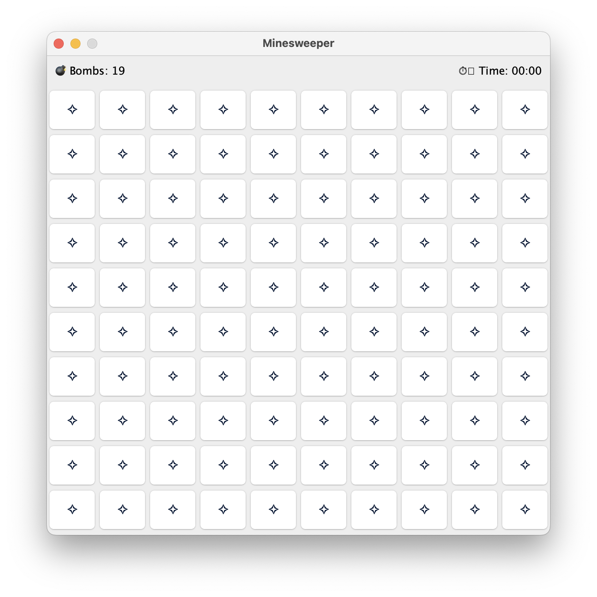
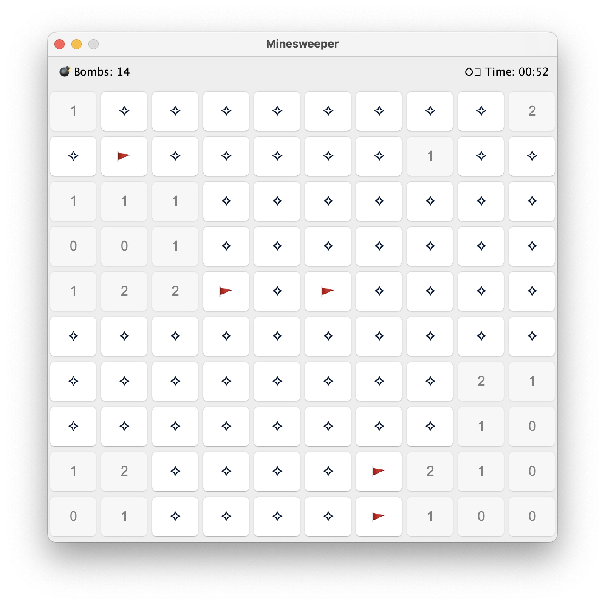
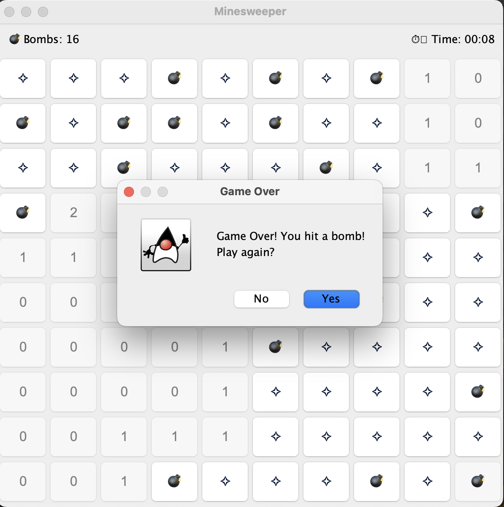

# Minesweeper Game

A fully-functional Minesweeper implementation in Java Swing featuring recursive flood-fill algorithm, real-time timer, and interactive flagging system.

## 🎮 Features

- **Classic Minesweeper Gameplay** - 10x10 grid with randomized bomb placement
- **Right-Click Flagging System** - Mark suspected bomb locations to prevent accidental clicks
- **Real-Time Game Timer** - Tracks elapsed time in MM:SS format, starting on first click
- **Dynamic Bomb Counter** - Visual feedback showing remaining unflagged bombs
- **Auto-Reveal Algorithm** - Implements recursive flood-fill to reveal connected empty cells
- **Win/Loss Detection** - Automatic game-over detection with replay option
- **Clean GUI** - Professional interface built with Java Swing

## 📸 Screenshots

### Game Start

*Clean interface with bomb counter and timer at the top*

### Gameplay

*Flood-fill algorithm revealing connected empty cells*

### Game Over

*All bombs revealed when player hits a mine*

## 🔧 Technical Highlights

### Recursive Flood-Fill Algorithm
The most algorithmically interesting feature is the auto-reveal functionality. When a player clicks a cell with zero adjacent bombs, the game recursively reveals all connected empty cells using a flood-fill algorithm:

```java
public void revealCell(int row, int col) {
    // Base cases: boundary check, already revealed, flagged
    if (row < 0 || row >= GRID_SIZE || col < 0 || col >= GRID_SIZE) return;
    if (!buttons[row][col].isEnabled()) return;
    if (flagged[row][col] || gameOver) return;
    
    // Reveal current cell
    int cellCount = grid.getCountAtLocation(row, col);
    buttons[row][col].setText(String.valueOf(cellCount));
    buttons[row][col].setEnabled(false);
    
    // Recursively reveal neighbors if count is 0
    if (cellCount == 0) {
        for (int i = row - 1; i <= row + 1; i++) {
            for (int j = col - 1; j <= col + 1; j++) {
                revealCell(i, j);  // Recursive call
            }
        }
    }
}
```

### Event Handling
- **ActionListener** for left-click cell reveals
- **MouseListener** for right-click flagging
- **Swing Timer** for real-time clock updates every second

### State Management
- 2D boolean arrays track flagged and revealed cells
- Defensive copying in Grid getters to maintain encapsulation
- Guard clauses prevent invalid moves (clicking flagged cells, playing after game over)

## 🚀 How to Run

### Prerequisites
- Java Development Kit (JDK) 8 or higher

### Compilation and Execution
```bash
# Compile all Java files
javac *.java

# Run the game
java Main
```

## 🎯 How to Play

1. **Start the game** - Click any cell to begin (timer starts automatically)
2. **Left-click** to reveal a cell
   - Numbers indicate how many bombs are adjacent
   - Clicking a bomb ends the game
3. **Right-click** to place/remove a flag on suspected bombs
   - Flagged cells cannot be revealed until unflagged
4. **Win condition** - Reveal all safe cells without hitting a bomb
5. **Play again** - Click "Yes" in the dialog to restart

## 📁 Project Structure

```
Minesweeper/
├── Main.java              # Entry point
├── MinesweeperGUI.java    # GUI implementation and game logic
├── Grid.java              # Backend grid and bomb placement logic
└── README.md              # This file
```

## 🛠️ Key Classes

### Grid.java
- Manages bomb placement using probability-based randomization
- Calculates adjacent bomb counts for each cell
- Provides encapsulated access to grid data

### MinesweeperGUI.java
- Implements all GUI components using Java Swing
- Handles user input via ActionListener and MouseListener
- Manages game state (timer, flags, win/loss conditions)
- Contains recursive flood-fill algorithm for auto-reveal

## 🔮 Future Enhancements

- [ ] Difficulty level selection (Easy: 8x8, Medium: 10x10, Hard: 16x16)
- [ ] High score tracking with persistent storage
- [ ] First-click guarantee (ensure first click is never a bomb)
- [ ] Color-coded numbers for better visual distinction
- [ ] Custom grid size and bomb count settings

## 📚 What I Learned

- **Recursive Algorithms** - Implementing flood-fill for graph traversal
- **GUI Programming** - Java Swing components, layouts, and event handling
- **State Management** - Tracking complex game state across multiple data structures
- **Software Design** - Separation of concerns (Grid backend vs GUI frontend)
- **Event-Driven Programming** - Responding to user input via listeners

## 📝 License

This project was created as a learning exercise and portfolio piece. Feel free to use it for educational purposes.

## 👤 Author

Fidel Perez
- GitHub: [@FidelAP-19](https://github.com/FidelAP-19)
- LinkedIn: [Fidel Perez](https://www.linkedin.com/in/fidel-perez-51288929b/)

---

**⭐ If you found this project interesting, please consider giving it a star!**
